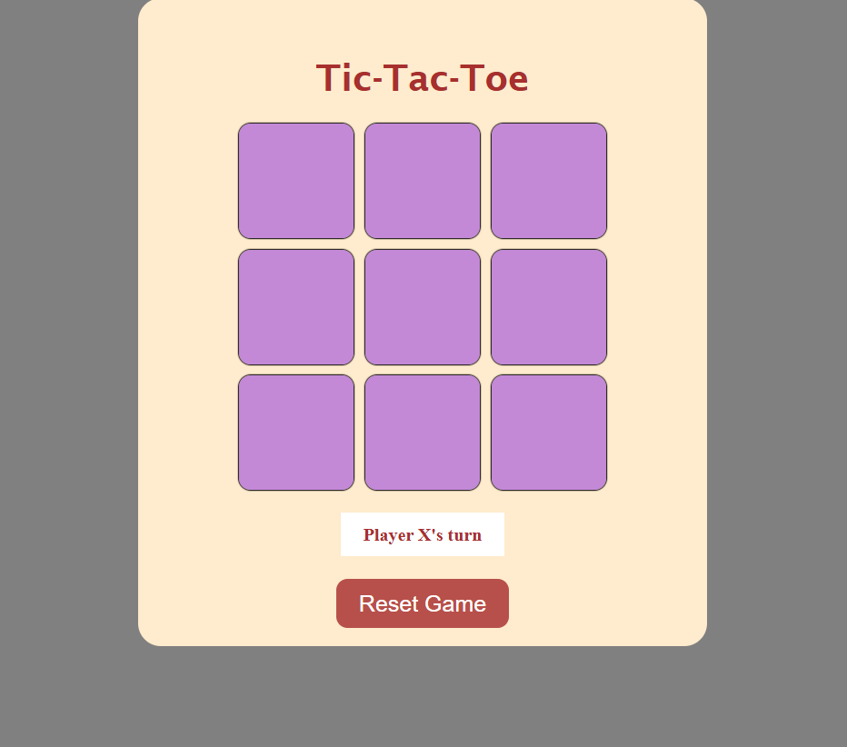

# 🎮 Tic-Tac-Toe Game

A simple and responsive Tic-Tac-Toe game developed using **HTML**, **CSS**, and **JavaScript**.  
This two-player game automatically detects winners and draws, and includes a reset feature.  
It provides a fun and interactive user experience across all devices.

---

## 📌 Summary

This marks my **third repository**:

- Built with **HTML**, **CSS**, and **JavaScript**
- Learned how to manipulate the **DOM** and structure interactive web pages
- **Suggestions and contributions are most welcome!**
- A small step toward building more advanced projects in the future

---

## 🚀 Deployment

🔗 [Live Demo on Netlify](https://ayeshastictactoe.netlify.app/)

---

## ⚙️ Features

- **👥 Two-player mode** – Players take turns placing X and O on a 3x3 board
- **✅ Win detection** – Automatically detects a win in rows, columns, or diagonals
- **🤝 Draw detection** – Declares a draw if all cells are filled without a winner
- **🔄 Reset option** – Restart the game anytime with one click
- **📱 Responsive design** – Optimized for desktops, tablets, and mobile devices

---

## 🛠 Technologies Used

- **HTML5** – Structuring the game layout
- **CSS3** – Styling and responsive design
- **JavaScript (Vanilla)** – Game logic, event handling, and DOM manipulation

---

## 🖼 Screenshot

  
*Example of the Tic-Tac-Toe board in action*

---

## Acknowledgments

- The project was developed as a simple, fun way to learn and apply **JavaScript** and **DOM manipulation**.
- Inspiration was drawn from classic Tic-Tac-Toe games and web development tutorials.

Enjoy the game, and feel free to explore or customize the code further! 🎮 
