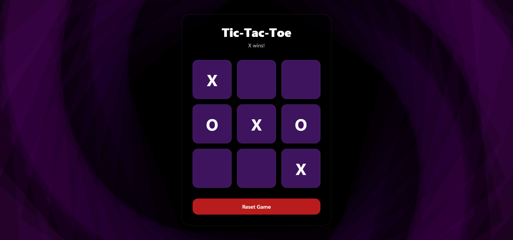

# ❌⭕ Tic-Tac-Toe

A modern Tic-Tac-Toe web application built using **Next.js, React, TypeScript, and Tailwind CSS**.

Designed with a responsive interface and smooth gameplay experience, the application focuses on interactive frontend functionality, real-time UI updates, and clean component-driven architecture.

## 🌐 Live Demo

https://tic-tac-toe-two-psi-40.vercel.app/

---

## ✨ Features

- Fully playable Tic-Tac-Toe game
- Dynamic turn switching
- Win detection system
- Reset game functionality
- Responsive layout
- Modern UI design
- Real-time board updates
- Component-based architecture

---

## 🚀 Tech Stack

- Next.js 16
- React 19
- TypeScript
- Tailwind CSS

---

## 📸 Screenshots

---

## 🧠 What I Learned

- React state management
- Conditional rendering
- Game logic implementation
- Handling dynamic UI updates
- Managing user interactions
- Structuring applications with Next.js
- Building responsive interfaces using Tailwind CSS

This project helped improve my understanding of interactive frontend application development and real-time state-driven UI behavior.

---

## 💡 Future Improvements

- Multiplayer support
- AI opponent
- Score tracking
- Match history
- Sound effects and animations
- Online gameplay
- Difficulty levels

---

## 👩‍💻 Author

**Ayesha Ansari**

Built with ❤️ using Next.js and Tailwind CSS